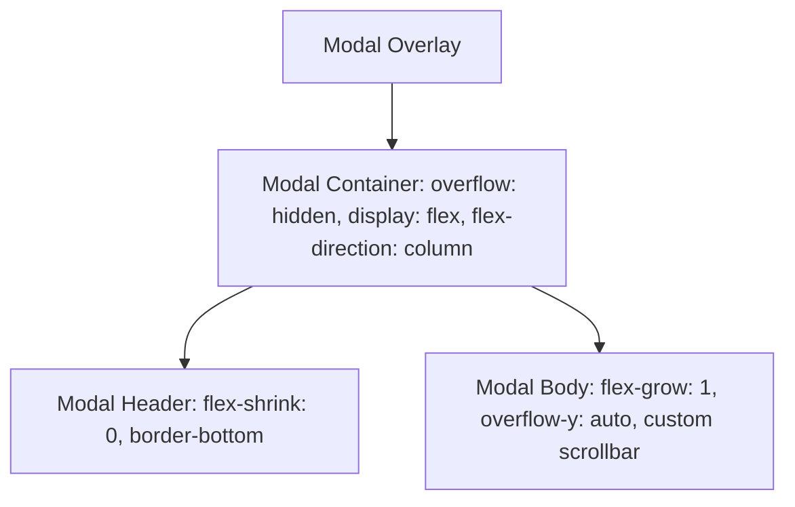

# Implementation Plan — Minimalist Checkout Scrollbar & Alignment

This plan outlines the engineering steps to fix the visual alignment of the donation form's vertical scrollbar and replace it with a sleek, custom-designed minimalist scrollbar.

---

## The Issue
1. **Misaligned Rounded Corner Clipping**: Currently, `.modal` has `overflow-y: auto` and a border radius of `24px`. Browser scrollbars are straight, causing them to clip the rounded top/bottom corners awkwardly.
2. **Scrolling Header**: When scrolling the modal content, the header (with the Close button) scrolls out of view, forcing the user to scroll back up to exit.
3. **Crowded Layout**: The scrollbar sits right against the close button, disrupting the header alignment.

---

## Proposed Solution
We will transition the modal layout to a **sticky-header flexbox architecture** and move scrolling exclusively to the modal body.



### Key Upgrades:
- **Sticky Header**: The modal header stays fixed at the top, ensuring the "Complete Your Donation" title and close button are always anchored and accessible.
- **Scrollbar Isolation**: Moving `overflow-y: auto` to `.modal__body` prevents the scrollbar from intersecting the top rounded corners of the modal.
- **Minimalist Styling**: Implement a lightweight, custom scrollbar with a semi-transparent brand accent thumb (`rgba(66, 133, 244, 0.2)`) and a transparent track.

---

## Proposed Changes

### [MODIFY] [Modal.css](file:///c:/Users/Lenovo/OneDrive/Documents/Donation%20site/Donation-Site-Project/client/src/components/ui/Modal.css)
- Restructure `.modal` to use flex layout and disable outer overflow:
  ```css
  .modal {
    background: var(--color-bg-secondary);
    border: 1px solid var(--color-border);
    border-radius: var(--radius-xl);
    width: 100%;
    max-height: 90vh;
    display: flex;
    flex-direction: column;
    overflow: hidden; /* Mask rounded corners, prevent layout leaking */
    animation: modalIn 0.35s cubic-bezier(0.34, 1.56, 0.64, 1);
    box-shadow: var(--shadow-lg), var(--shadow-glow-purple);
  }
  ```
- Make `.modal__header` fixed:
  ```css
  .modal__header {
    display: flex;
    align-items: center;
    justify-content: space-between;
    padding: var(--space-lg) var(--space-xl);
    border-bottom: 1px solid var(--color-border);
    flex-shrink: 0; /* Keep size constant */
  }
  ```
- Move scrollbar and scrolling to `.modal__body`:
  ```css
  .modal__body {
    padding: var(--space-xl);
    overflow-y: auto; /* Only body scrolls */
    flex-grow: 1;
  }
  ```
- Implement ultra-premium minimalist scrollbar styling using brand color custom properties:
  ```css
  /* Scrollbar inside modal body */
  .modal__body::-webkit-scrollbar {
    width: 6px;
  }

  .modal__body::-webkit-scrollbar-track {
    background: transparent;
  }

  .modal__body::-webkit-scrollbar-thumb {
    background: rgba(66, 133, 244, 0.18); /* Subtle brand blue */
    border-radius: var(--radius-full);
    transition: background var(--transition-fast);
  }

  .modal__body::-webkit-scrollbar-thumb:hover {
    background: rgba(66, 133, 244, 0.35); /* Interactive state */
  }
  ```

---

## Verification Plan

### Automated Checks
1. Validate client build: Run `npm run build` in `/client` to verify Vite builds successfully with zero errors.

### Manual Verification
1. **Modal Header Lock Test**: Open the checkout modal and verify the header remains static while the form is scrolled.
2. **Scrollbar Aesthetics Test**: Check that the custom scrollbar starts below the header border, behaves smoothly, and changes opacity on hover.
3. **Corner Alignment Test**: Verify the scrollbar track does not overlap or distort the rounded corners at the bottom of the modal.
