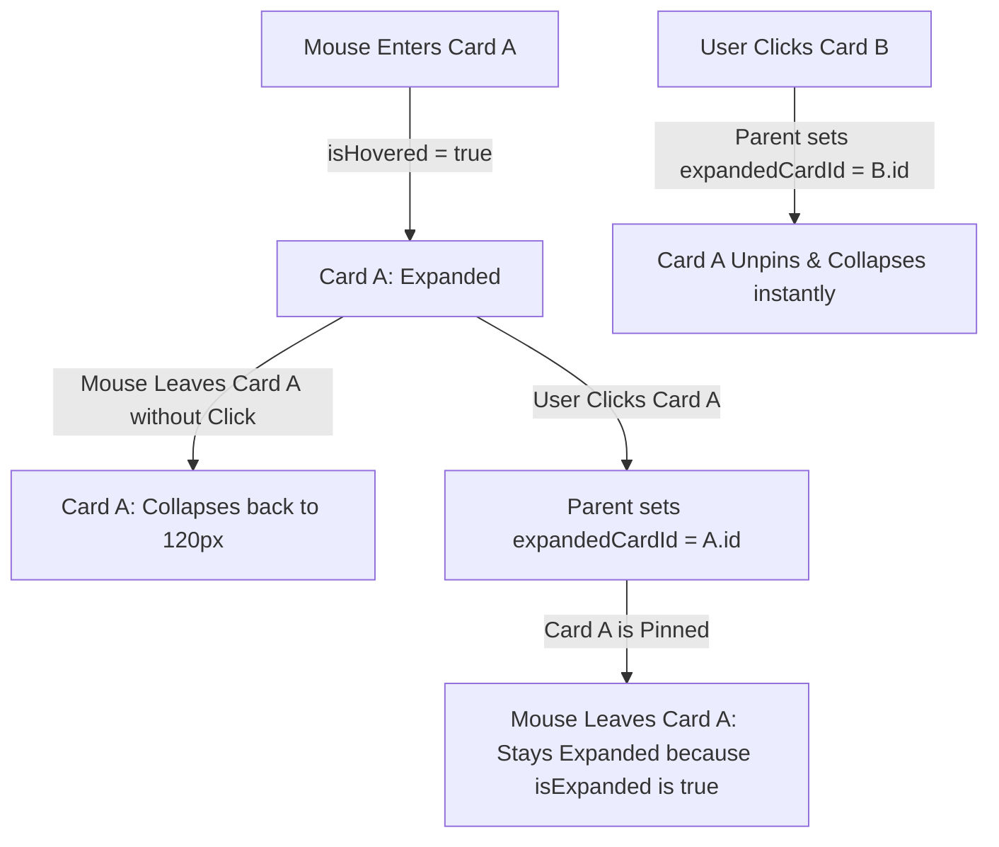

# Implementation Plan — Pinned Card Mutual Exclusion (State-Lifting)

This plan outlines the engineering steps to build a high-fidelity **Hover-Pinning Interaction Model** for all Monthly Donation cards:
1. **Hover-to-Preview**: Hovering over any card expands it temporarily. Hovering away collapses it, *unless* they clicked it.
2. **Click-to-Pin (Mutual Exclusion)**: Clicking a card "pins" it open, keeping it expanded even when the mouse leaves.
3. **Single Pinned Card Guarantee**: Only one card can be pinned open at a time. Clicking another card unpins the first card immediately.
4. **Click Pinned Card to Unpin**: Clicking the pinned card a second time collapses (unpins) it.

---

## Proposed Changes

### 1. State Lifting & Pinning Logic

We will lift the pinning state to the parent `DonationGrid` to guarantee mutual exclusion, while keeping hover states localized in the child card components.



#### [MODIFY] [DonationGrid.jsx](file:///c:/Users/Lenovo/OneDrive/Documents/Donation%20site/Donation-Site-Project/client/src/components/donation/DonationGrid.jsx)
- Maintain parent `expandedCardId` state: `const [expandedCardId, setExpandedCardId] = useState(null);`
- Provide `toggleExpand(id)` that toggles the ID or sets it to `null` if clicked again.
- Pass `isExpanded={expandedCardId === box.id}` and `onToggleExpand={() => toggleExpand(box.id)}` to all `DonationCard` elements.

#### [MODIFY] [DonationCard.jsx](file:///c:/Users/Lenovo/OneDrive/Documents/Donation%20site/Donation-Site-Project/client/src/components/donation/DonationCard.jsx)
- Manage local `isHovered` state. Receive `isExpanded` and `onToggleExpand` as props.
- Keep `isOpen = isExpanded || isHovered`.
- Clear only hover state on `onMouseLeave`:
  ```jsx
  onMouseLeave={() => setIsHovered(false)}
  ```
- This ensures that if the card is NOT clicked (`isExpanded` is false), it collapses immediately when mouse leaves. If it WAS clicked, it stays pinned open!
- Bind `onClick={() => onToggleExpand()}` on the card element.

---

## Verification Plan

### Automated Checks
1. Validate client build: Run `npm run build` in `/client` to verify Vite builds successfully.

### Manual Verification
1. **Hover-to-Preview Test:**
   - Hover mouse over "Regular" card. It expands.
   - Move mouse away without clicking. Verify it collapses instantly back to `120px`.
2. **Click-to-Pin Test:**
   - Hover and click the "Regular" card.
   - Move mouse away. Verify that the card **remains expanded** (pinned).
3. **Mutual Exclusion Test:**
   - With "Regular" pinned, click the "Shareholder" card.
   - Verify "Regular" card **retracts immediately**, and "Shareholder" card is now pinned open.
4. **Double Click Unpin Test:**
   - Click the pinned "Shareholder" card again. Verify it unpins and collapses immediately.
