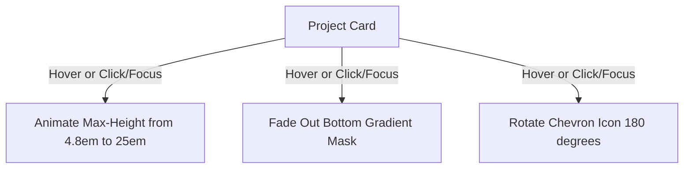

# Implementation Plan — Interactive Project Hover & Dynamic Donation Tiers

This implementation plan outlines the architecture, styling changes, and backend/frontend integrations required to deliver a premium user experience for project details expansion and single-source-of-truth donation tier mapping.

## User Review Required

> [!IMPORTANT]
> **Mobile & Accessibility Guard for Hover Expansion**
> While hover-based expansion creates a breathtaking desktop experience, hover states do not exist on touch devices (phones/tablets). To maintain an outstanding mobile experience, we will **preserve and enhance the click-to-expand toggle state and accessible buttons** alongside the hover-expand behavior. This ensures absolute compatibility across all screen sizes and complies with WCAG accessibility guidelines.

> [!TIP]
> **Database Single-Source-of-Truth**
> To prevent duplicate data and editing friction, the **`Tier` table** in the database will become the single source of truth for perks. Editing the perks array for "Regular", "Shareholder", or "Patron" tiers will **automatically propagate** to both the bottom details list and the top-grid donation boxes at runtime.

---

## Proposed Changes

We will modify client CSS, components, page fallbacks, and the backend content delivery route.

### 1. Hover-Expandable Project Cards with Smooth CSS Transitions

Currently, `-webkit-line-clamp` is used to truncate description text. Since line-clamp is a discrete property and cannot be animated, we will refactor the card to use a `max-height` transition combined with a sleek glassmorphic gradient overlay that fades out when expanded.

#### [MODIFY] [ProjectsSection.css](file:///c:/Users/Lenovo/OneDrive/Documents/Donation%20site/Donation-Site-Project/client/src/components/donation/ProjectsSection.css)
* Replace the rigid `-webkit-line-clamp` properties on `.project-card__details` with a responsive wrapper.
* Set `.project-card__details` default state:
  * `max-height: 4.8em;` (exactly 3 lines under 1.6 line-height)
  * `overflow: hidden;`
  * `position: relative;`
  * `transition: max-height 0.4s cubic-bezier(0.25, 1, 0.5, 1), color 0.3s ease;`
* Add `.project-card__fade-mask`:
  * A linear gradient overlay `linear-gradient(to bottom, rgba(26, 21, 44, 0), var(--color-bg-card))` to subtly blend the clipped text into the card's background.
  * `transition: opacity 0.3s ease;`
* Add hover and expanded selectors:
  * `.project-card:hover .project-card__details`, `.project-card.project-card--expanded .project-card__details`:
    * Expand `max-height` smoothly to `400px` (or `25em`).
  * `.project-card:hover .project-card__fade-mask`, `.project-card.project-card--expanded .project-card__fade-mask`:
    * Set `opacity: 0` to cleanly show the full, uninterrupted text.
  * `.project-card:hover .project-card__chevron`, `.project-card.project-card--expanded .project-card__chevron`:
    * Rotate chevron 180 degrees (`transform: rotate(180deg)`).

#### [MODIFY] [ProjectsSection.jsx](file:///c:/Users/Lenovo/OneDrive/Documents/Donation%20site/Donation-Site-Project/client/src/components/donation/ProjectsSection.jsx)
* Add `
` dynamically at the end of the details block.
* Synchronize hover styles with click interactions to guarantee accessible functionality for screen-readers and mobile users.

---

### 2. Single-Source-of-Truth Donation Tiers & Automatic Propagations

To make donation perks easily editable in one location, we will dynamically link the `DonationBox` models to the `Tier` models. When a user updates the perks inside a `Tier` record, the application will automatically format and push those perks to the `DonationCard` components in the payment grid.

#### [MODIFY] [content.js](file:///c:/Users/Lenovo/OneDrive/Documents/Donation%20site/Donation-Site-Project/server/src/routes/content.js)
* Update the public content controller `GET /api/v1/content` to automatically inject matching tier perks:
  * Iterate through fetched `donationBoxes`.
  * For each `box` where `isCustomAmount` is `false`:
    * Find the matching `Tier` record where `tier.name.toLowerCase() === box.title.toLowerCase()`.
    * If a match exists, parse `tier.perks` (JSON list).
    * Map the detailed perks to shorter, card-friendly versions or join the perks array using `" | "` to dynamically populate the `box.tierDetails` string.
    * This ensures that editing the `Tier` table updates the subscription cards instantly at query time with zero redundancy!

#### [MODIFY] [DonationPage.jsx](file:///c:/Users/Lenovo/OneDrive/Documents/Donation%20site/Donation-Site-Project/client/src/pages/DonationPage.jsx)
* Update the client-side `useEffect` catch block fallback data:
  * Fully populate the fallback `tiers` array with official, rich perks matching the donation guidelines.
  * Map `donationBoxes` dynamically to construct their `tierDetails` directly from the `tiers` fallback perks array.
  * This guarantees that editing the local tiers fallback list automatically updates the donation boxes correctly, matching the production database's runtime behavior even in offline/demo mode!

#### [MODIFY] [seed.js](file:///c:/Users/Lenovo/OneDrive/Documents/Donation%20site/Donation-Site-Project/server/prisma/seed.js)
* Ensure that the seeded tiers' perks are rich, descriptive, and perfectly match the official tiers structure.
* Remove static details from the seeded donation boxes where possible to rely entirely on the dynamic backend mapper.

---

## Verification Plan

### Automated & Syntactic Checks
1. Validate client build: Run `npm run build` inside `client/` to verify CSS compiles cleanly.
2. Validate backend syntax: Run `npm run dev` in `server/` to verify no import or query execution errors in Prisma.

### Manual Verification
1. **Interactive Hover Test**:
   * Open the donation site. Hover your mouse cursor over the project cards (e.g., *Train The Trainer Camp*).
   * Verify that the description container expands smoothly downwards without any layout breakages.
   * Verify that the text fade gradient overlay disappears as the card expands.
   * Verify that the expand chevron rotates 180 degrees.
2. **Accessibility & Responsive Test**:
   * Inspect the project card using Chrome DevTools in Mobile Emulation mode.
   * Click the "Read more" button and verify the card expands properly on tap, updating the text to "Show less".
   * Press `Tab` to navigate to the expand button and press `Enter`/`Space`. Verify correct toggle behavior.
3. **Automatic Tier Propagations Test**:
   * Update a tier's perks in `seed.js` or directly in the database.
   * Refresh the page. Verify both the **Donation Tier Grid** (below) and the **Donation Box Cards** (above) instantly display the new, updated perk values.
